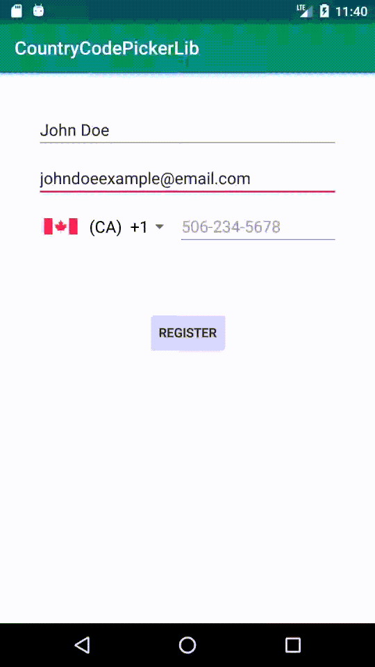
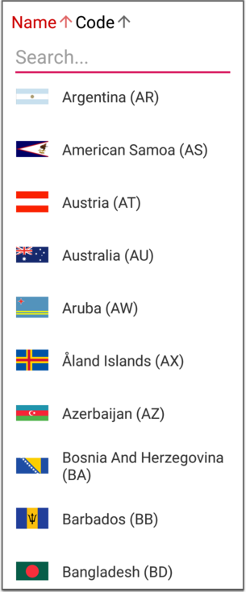
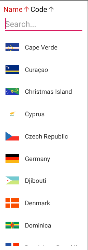
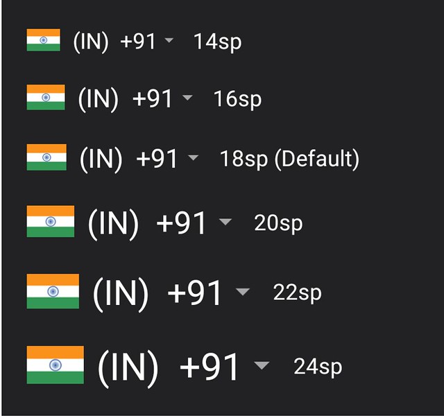
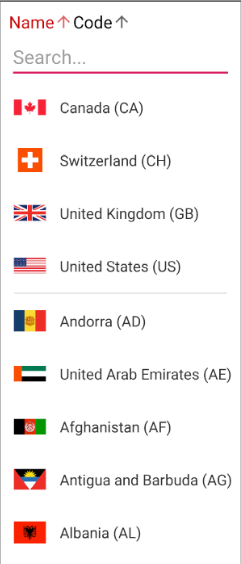
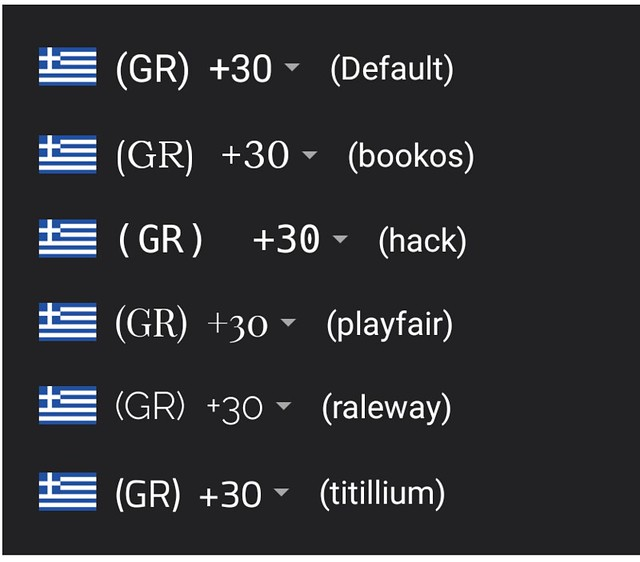
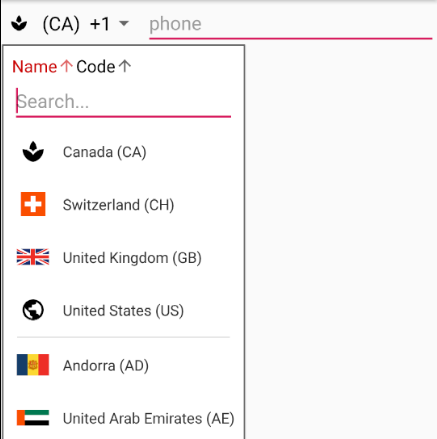

Country Code Picker Library
===========================

If you are looking for an android library for specifically Country/CountryCode/CountryPhone drop-down style picker, this is the best you can find at the moment.

Country Code Picker (CCP)  or

  is an android library which provides an easy way to search and select country or country phone code for the telephone number.
  
  

Introduction
------------
* Give a professional touch to your well designed form like login screen, sign up screen, edit profile screen with CCP. When used as phone code picker, it helps by removing confusion about how to add phone number and making view more understandable. 
	  
* With CCP you can get following views easily without boilerplate code. (Left: Phone code selector. Right: Country Selector)

    -          
    
* Tapping on CCP will open a dialog to search and select country (Left: Phone code selector. Right: Country Selector)
    -          

How to add to your project
--------------

Add this to your gradle file and sync

Usage
---------
Add CountryCodePicker view to XML layout
```xml
<com.gbksoft.countrycodepickerlib.CountryCodePicker
    android:id="@+id/countryCodePickerView"
    android:layout_width="wrap_content"
    android:layout_height="wrap_content"
    />
```
Add CCP object in Activity / Fragment and bind it from layout
```java
CountryCodePicker ccp = (CountryCodePicker) findViewById(R.id.countryCodePickerView);
```

That's it. Run the project and see the results

To blend CCP with your project's theme style, you can modify [CCP Theme](#CCP-Theme-Customization) and [CCP Dialog Theme](#CCP-Dialog-Theme-Customization)

Full Number Support
-------------------

Along with country and phone code selection, CCP offers all features which are required to support full number.

1.  [Setup](#1-setup)
2.  [Auto-Formatting](#2-auto-formatting)
3.  [Number Validation](#3-number-validation)
4.  [Number Validity Change Listener](#4-number-validity-change-listener)
5.  [Load Full Number](#5-load-full-number)
6.  [Read Full Number](#6-read-full-number)

**Full Number is concatenation of country code and carrier number** i.e. if the country code is _+1_ and carrier number is _469 663 1766_ then the full number will be _+14696631766_ or _14696631766_.

## [](#1-setup)1\. SETUP

* Add CCP view and editText of carrier number to XML layout
```xml
<LinearLayout xmlns:android="http://schemas.android.com/apk/res/android"
	android:layout_width="match_parent"
	android:layout_height="wrap_content"
	android:gravity="center_vertical">

	<com.gbksoft.countrycodepickerlib.CountryCodePicker
		android:id="@+id/ccp"
		android:layout_width="wrap_content"
		android:layout_height="wrap_content" />

	<EditText
		android:id="@+id/editText_carrierNumber"
		android:layout_width="match_parent"
		android:layout_height="wrap_content"
		android:hint="phone"
		android:inputType="phone"
		android:singleLine="true" />
</LinearLayout>
```

* Add CCP object in Activity / Fragment and Bind CCP and Carrier Number editText from layout
```java
CountryCodePicker ccp = (CountryCodePicker) findViewById(R.id.ccp);
EditText editTextCarrierNumber = (EditText) findViewById(R.id.editText_carrierNumber);
```

* Attach CarrierNumber editText to CCP.
```java
ccp.registerCarrierNumberEditText(editTextCarrierNumber);
```

## [](#2-auto-formatting)2\. Auto Formatting

Auto formatting will keep carrier number formatted for selected country standerd. When you select country US (+1) and type _4696641777_ in Carrier Edit Text, it will be formatted for US number format _(469) 664-1777_ as you type in.

By default, auto formatting is enabled for registered carrier number editText. So after successful [setup](#1-setup) , number in _editTextCarrierNumber_ will be auto formatted as you type or load fullNumber in CCP.

To disable auto-formatting, add `app:ccp_autoFormatNumber="false"` property to CCP XML entry or call `ccp.setNumberAutoFormattingEnabled(false);`.

## [](#3-number-validation)3\. Number Validation

Once the [setup](#1-setup) is completed, you can validate entered full-number using `ccp.isValidFullNumber();`. Using this, a developer can keep end user from submitting wrong phone or invalid phone number. This function will return the validation status at the time of calling it. So this can be used when you want to check if valid phone number is entered before submitting the form.

## [](#4-number-validity-change-listener)4\. Number Validity Change Listener

Validity Change Listener will get callBack every time validity of entered number changes.
```java
ccp.setPhoneNumberValidityChangeListener(new CountryCodePicker.PhoneNumberValidityChangeListener() {
                @Override
                public void onValidityChanged(boolean isValidNumber) {
                   // your code
                }
            });
```

## [](#5-load-full-number)5\. Load Full Number

After [setup](#1-setup), if you need to load existing full number, i.e. Edit Profile screen where you already have user's full phone number, then `ccp.setFullNumber(existingFullNumber);` should be used. This will auto-detect country & carrier number from full number and load in CCP & carrier number editText.

"+" in beginning of _existingFullNumber_ is optional. "14696641766" or "+14696641766", both will set _US +1_ in CCP and _469-664-1766_ in carrier number edittext.

## [](#6-read-full-number)6\. Read Full Number

After successful [setup](#1-setup) when the user has entered a number, you can read that full number in 3 different versions.
```java
    //get formatted number i.e "+1 469-664-1766"
    ccp.getFormattedFullNumber();

    //get unformatted number i.e. "14696641766"
    ccp,.getFullNumber();

    //get unformatted number with prefix "+" i.e "+14696641766"
    ccp.getFullNumberWithPlus();
```

Use as a Country Selector
--------
You might need a country selector instead of country phone code selector. You can do it easily using CCP.

All you will need to do is:

Use full-width layout using `android:layout_width="match_parent"`.
Show full name using `app:ccp_showFullName="true"`.
Remove phone code using `app:ccp_showPhoneCode="false"`.
Remove name code using `app:ccp_showNameCode="false"`. (Optional)
Done! Your country selector / country spinner is ready.

```xml
<com.gbksoft.countrycodepickerlib.CountryCodePicker
	android:id="@+id/countryCodePickerView"
	android:layout_width="wrap_content"
	android:layout_height="wrap_content"
	app:ccp_showFullName="true"
	app:ccp_showPhoneCode="false"
	app:ccp_showNameCode="false"
	/>
```
this will turn your phone selector into country selector.
 

By default, the text gravity of the name will be "CENTER". You can change it using `app:ccp_textGravity="LEFT"` or `app:ccp_textGravity="RIGHT"`.

 
 


To customize dialog use this properties `%ccpDropDown_`
```xml
<com.gbksoft.countrycodepickerlib.CountryCodePicker
	android:id="@+id/countryCodePickerView"
	android:layout_width="wrap_content"
	android:layout_height="wrap_content"
	app:ccpDropDown_showFullCountryName="true"
	app:ccpDropDown_showPhoneCode="false"
	app:ccpDropDown_showNameCode="false"
	/>
```



<a name="CCP-Theme-Customization"></a> Custom Content Color
------------


The color of CCP content can be changed according to the different UI colors.

### XML
* Add `app:ccp_contentColor` property to xml layout
```xml
    <com.gbksoft.countrycodepickerlib.CountryCodePicker
    			android:id="@+id/countryCodePickerView"
    			android:layout_width="wrap_content"
    			android:layout_height="wrap_content"
    			app:ccp_contentColor="@color/custom_color"
    			/>
```
* 

### Programmatically
* To set color programmatically, use `setContentColor()` method.
* 

Custom TextSize
-------
* Text size of CCP content can be changed in order to match rest of the view of form
* Everytime when textSize is updated, arrowsize will be updated itself.
* 

### XML
Add `app:ccp_textSize="24sp"` property to xml layout
### Programmatically
To set color programmatically, use `setTextSize(40)` method.

## Flag Border Color
* For some UI designs, more clear visibility of flags can be achieved by adding border color. This is helpful for flags which has background matching color.

### XML
Add `app:ccp_flagBorderColor="@color/colorAccent"` property to xml layout

### Programmatically
To set it programmatically, use `setFlagBorderColor(Color.RED)` method `//should be @ColorInt`

## Custom arrow size
* Size if Down arrow of CCP view can be modified in order to match rest of the view of form.

### XML
Add `app:ccp_arrowSize="20dp"` property to xml layout

### Programmatically
To set textSize programmatically, use `setArrowSize(100)` method.

## Custom arrow color
* If you want to set arrow color other than content color, set specific arrow color using this property.

### XML
Add `app:ccp_arrowColor="@color/custom_arrow_color"` property to xml layout

### Programmatically
To set arrowColor programmatically, use `setArrowColor(Color.RED)` method `//should be @ColorInt`


## <a name="CCP-Dialog-Theme-Customization"></a>CCP Dialog Theme Customization
You can customize selection dialog's theme so that it gives native view feeling.

By using following properties, you can customize the look of country selection dialog
```xml
<com.gbksoft.countrycodepickerlib.CountryCodePicker
    android:id="@+id/countryCodePickerView"
    android:layout_width="wrap_content"
    android:layout_height="wrap_content"
    app:ccpDialog_searchEditTextTint="@color/custom_editText_tint"
    app:ccpDialog_backgroundColor="@color/custom_dialog_backgroud_color"
    app:ccpDialog_textColor="@color/custom_dialog_text"
    app:ccpDialog_fastScroller_bubbleColor="@color/custom_fastScroller_bubble"
    app:ccpDialog_fastScroller_bubbleTextAppearance="@style/custom_text_appearance"
    app:ccpDialog_fastScroller_handleColor="@color/custom_fastScroller_handle_color"
    app:ccpDialog_showTitle = "false"
    />
```

# Auto detect country
## [](#ccp-can-auto-detect-users-country)CCP can auto detect user's country.

*   It can be enabled by adding XML property `app:ccp_autoDetectCountry="true"` in CCP view
*   Default value of app:ccp_autoDetectCountry is FALSE (Before 2.1.0, it was true which was confusing for many developers)
*   **app:ccp_rememeberLastSelection="true"** can override auto detected country by last selected country
*   The country is detected at the runtime, so it can not be shown in the Android Studio preview of the layout.
*   _SIM_NETWORK_LOCALE_ is the default preference order

## [](#ways-to-detect-country)Ways to detect country

Library uses 3 ways to detect user's location.

1.  Using SIM info
    *   This will detect country from an inserted sim.
    *   Devices without sim tray will not give expected result
    *   Read more on [official site](https://developer.android.com/reference/android/telephony/TelephonyManager.html#getSimCountryIso()).
2.  Using Network info
    *   This will detect country from connected network's information
    *   Read more in [official site](https://developer.android.com/reference/android/telephony/TelephonyManager.html#getNetworkCountryIso()).
3.  Using Locale
    *   Detect country from device's locale info.

## [](#preference-and-order-of-options)Preference and order of options

*   Library provides flexibility when it comes to order of execution of these options.
*   Order can be specified with `app:ccp_countryAutoDetectionPref="LOCALE_SIM"`
*   e.g. "SIM_ONLY" will detect country from sim card. If it fails then ccp will reset to default country.
*   e.g. "SIM_NETWORK" will try from SIM details, if it fails then will try to find from network info then will reset to default country
*   e.g. "SIM_NETWORK_LOCALE" will follow SIM -> NETWORK -> LOCALE order.

## [](#all-available-options)All available options

*   SIM_ONLY
*   NETWORK_ONLY
*   LOCALE_ONLY
*   SIM_NETWORK
*   NETWORK_SIM
*   SIM_LOCALE
*   LOCALE_SIM
*   NETWORK_LOCALE
*   LOCALE_NETWORK
*   SIM_NETWORK_LOCALE
*   SIM_LOCALE_NETWORK
*   NETWORK_SIM_LOCALE
*   NETWORK_LOCALE_SIM
*   LOCALE_SIM_NETWORK
*   LOCALE_NETWORK_SIM

> **ccp_autoDetectCountry** must be enabled to detect country at the time of layout prepartion

# Auto Detect Language

## [](#ccp-can-auto-detect-language)CCP can auto-detect Language.

*   It can be enabled by adding XML property `app:ccp_autoDetectLanguage="true"` in CCP view
*   Default value of app:ccp_autoDetectLanguage is FALSE
*   CCP supports set of languages. Check the latest list of supported languages at `attrs.xml` from ccp_defaultLanguage attribute.
*   When auto detect language is enabled, if device language is one of the CCP supported languages, then CCP and selection will be set to that language.
*   The language is detected at the runtime, so it can not be shown in the Android Studio preview of the layout.


# Remember last selection

For some use-cases it is required that selection of country remains unchanged when app is restarted or activity is relaunched.

## [](#how-to-enable)How to enable?

*   To enable this, add `app:ccp_rememberLastSelection="true"` in XML of your CCP.
*   First time when there is no history of country selection, it will set default country or auto-detected country (if autoDetectCountry is enabled) in CCP.
*   Now whenever user will select some country from a CCP dialog, that will be recorded on shared preferences.
*   From next run, this will load last selected country and override default country or autodetected country.

## [](#more-than-one-ccp)More than one CCP?

*   If you are working with multiple CCP views, you might want to save different selections for each.
*   Simply by providing different memory tags, different selections will be maintained for each CCP.
*   To specify tag, add `app:ccp_selectionMemoryTag="anyDifferentString"` to CCP along with `app:ccp_rememberLastSelection="true"` in XML of CCP.

# Country Preference

*   Countries of preference will be listed at the top in selection dialog. It is helpful when the target audience is from a set of countries.

*   The library has a list of countries in alphabetical order. It searches for the country in same order. But preferred country/countries have higher priority than rest.

*   When more than one countries have the same code. For example, Canada, Puerto Rico and the US have +1.

*   If US is set in country preference, order for search will be (1)US-(2)Canada-(3)Puerto Rico, so it will pick the US for +1.

*   Any number of countries can be set in preference.

#### [](#set-through-xml)Set through xml

Add app:ccp_countryPreference="gb,us,ca,ch" (replace "gb,us,ca,ch"  with your preference) to xml layout.

```xml
<com.gbksoft.countrycodepickerlib.CountryCodePicker
    android:id="@+id/ccp"
    android:layout_width="wrap_content"
    android:layout_height="wrap_content"
    app:ccp_countryPreference="gb,us,ca,ch" 
    />
```

#### [](#programmatically)Programmatically

Use `setCountryPreference()` method.

This is how it will be shown in dialog.




# Custom Master Country List

*   If your app expects users from only few countries then you might wish to remove all other countries from selection list.

    *   You can remove unnecessary countries by setting your custom master country list.

    *   Also it will keep user from selecting irrelevant country.

    *   Countries of preference will be listed at top in selection dialog. It is helpful when target audience is from a set of countries.

    *   Custom master list will only limit the visibility of irrelevant countries from selection dialog. But all other functions like setCountryForCodeName() or setFullNumber() will consider all the countries.

    *   Preferred country list will be a subset of custom master list. If some xyz country is not in custom master list, it won't be added to preferred country list.

    *   #### [](#set-through-xml)Set through xml

        *   add app:ccp_customMasterCountries="US,IN,NZ,BD,PL,RO,ZW" (replace "US,IN,NZ,BD,PL,RO,ZW" by your own country code names) to xml layout.

        ```xml
        <com.gbksoft.countrycodepickerlib.CountryCodePicker
           android:id="@+id/ccp"
           android:layout_width="wrap_content"
           android:layout_height="wrap_content"
           app:ccp_customMasterCountries="US,IN,NZ,BD,PL,RO,ZW" />
        ```

    *   #### [](#programmatically)Programmatically

        *   Use `setCustomMasterCountries()` method.
        *   `setCustomMasterCountries(null);` will remove custom list and revert to library default list.

# Exclude specific countries

Sometimes you want to remove some specific country from the list because of business requirement. With this feature, you can remove those specific countries from library's master list.
```xml
<com.gbksoft.countrycodepickerlib.CountryCodePicker
   android:id="@+id/ccp"
   android:layout_width="wrap_content"
   android:layout_height="wrap_content"
   app:ccp_excludedCountries="in,us,pk"  />
```

For example, the above code will exclude India (in), United States (us) and Pakistan (pk) from the library's master list. Programmatically it can be set using `ccp.setExcludedCountries("in,us,pk")`.

**Note:** `app:ccp_customMasterCountries` has higher priority than `app:ccp_excludedCountries` so if your ccp uses [custom master list of countries](#custom-master-country-list), then this will be ignored.

# Example phone number as edittext hint

## [](#feature-to-show-countrys-example-number-as-hint-placeholder-text)Feature to show Country's example number as hint (placeholder text)

If you want the user to know expected number then you can enable this feature using `app:ccp_hintExampleNumber="true"`. This will set example number as the hint (placeholder text) of registered carrier number edittext.

```xml
<com.gbksoft.countrycodepickerlib.CountryCodePicker
    android:id="@+id/ccp"
    android:layout_width="wrap_content"
    android:layout_height="wrap_content"
    app:ccp_hintExampleNumber="true" />
```

## [](#hintexamplenumbertype)HintExampleNumberType:

Once you enable hint feature, by default, hints will be of **_MOBILE_** number type. You can change to _**FIXED_LINE**_ or other using `app:ccp_hintExampleNumberType="FIXED_LINE"`.

```xml
<com.gbksoft.countrycodepickerlib.CountryCodePicker
    android:id="@+id/ccp"
    android:layout_width="wrap_content"
    android:layout_height="wrap_content"
    app:ccp_hintExampleNumberType="FIXED_LINE" />
```

# Country Change Listener

To get a call back when the selected country is changed, you need to add OnCountryChangeListener from java file.

```java
    countryCodePicker.setOnCountryChangeListener(new CountryCodePicker.OnCountryChangeListener() {
     	            @Override 
     	            public void onCountrySelected() {
     		                    Toast.makeText(getContext(), "Updated " + ccp.getSelectedCountryName(), Toast.LENGTH_SHORT).show();
            	    }
        	});
```

# CCP Dialog event listener

You might want to do something specific when the CCP dialog is launched, dismissed or canceled. Once the integration is completed, you can add a listener.

```java
    countryCodePicker.setDialogEventsListener(new CountryCodePicker.DialogEventsListener() {
                @Override
                public void onCcpDialogOpen(Dialog dialog) {
                    //your code
                }
    
                @Override
                public void onCcpDialogDismiss(DialogInterface dialogInterface) {
                    //your code
                }
    
                @Override
                public void onCcpDialogCancel(DialogInterface dialogInterface) {
                    //your code
                }
            });
```

# Custom TypeFace (FontFamily)

# [](#use-custom-typeface)Use custom typeFace

FontFamily or TypeFace of CCP view and dialog can be changed in order to match rest of the view of your screen.

*   Font can be set _only programmatically_.

*   
    *   Step 1: create a folder named 'assets' under 'app/src/main/' folder. If you already have 'app/src/main/assets' then jump to next step.
    *   Step 2: put your font's .ttf file in assets folder. For example if file name is 'myfonts.ttf', it should be 'app/src/main/assets/myfonts.ttf'. Make sure that the extension '.ttf' have contain small letters only. '.TTF' might not work.
    *   Step 3: Prepare typeFace using `Typeface typeFace=Typeface.createFromAsset(getContext().getAssets(),"myfonts.ttf");`
    *   Step 4: finally apply the type face on ccp `ccp.setTypeFace(typeFace);` OR `ccp.setTypeFace(typeFace,customStyle);` _Following above steps with apply "myfonts" to CCP view's text and dialog as well._

## [](#want-to-use-different-typefaces-for-ccp-view-and-dialog)Want to use different typefaces for CCP view and Dialog?

For flexibility, CCP maintains two typefaces. One for CCP view and one for dialog. For ease, it updates both when `ccp.setTypeFace();` is called.

*   If you want to use typeface only for dialog's text, use `ccp.setDialogTypeFace()`.
*   If want to use typeface for CCP view but want to keep dialog's typeface as default. SO should call `ccp.setTypeFace(typeFace,customStyle);` and then `ccp.setDialogTypeFace(null);`

# Read Selected Country Properties

## Country's 3 properties (Country name, phone code and name code) can be read individually.

#### [](#read-selected-country-phone-code)Read selected country phone code

*   To get selected country code as String type and without prefix “+”, use `getSelectedCountryCode();` method. => “91”
*   To get selected country code as String type and with prefix “+”, use `getSelectedCountryCodeWithPlus();` method. => “+91”
*   To get selected country code as int (Integer) type, use `getSelectedCountryCodeAsInt();` method. => 91

#### [](#read-selected-country-name)Read selected country name

*   To get selected country’s name in selected language, use `getSelectedCountryName();` => “India” (for english), "भारत" (for hindi)......
*   To get selected country's English name, use `getSelectedCountryEnglishName();` => "India" (English name, irrespective of selected language)

#### [](#read-selected-country-name-code)Read selected country name code

*   To get selected country’s name code, use `getSelectedCountryNameCode();` => “IN”

# Custom flag resources

If u want to change default flag images to your own implementation you can override it in this way.
Just create your own map with country as `key` and drawable resource as `value`:
```java
countryCodePicker = (CountryCodePicker) findViewById(R.id.countryCodePickerView);

        Map<String, Integer> customFlagsMap = new HashMap<>();

        customFlagsMap.put("US", R.drawable.ic_public_black_24dp);
        customFlagsMap.put("ca", R.drawable.ic_spa_black_24dp);

		countryCodePicker.setCustomFlagsForCountries(customFlagsMap);
```

Result:




# XML Properties

Here are all the XML properties available for CCP. Scroll down for detailed explanation of each...

```xml
<com.gbksoft.countrycodepickerlib.CountryCodePicker
    android:id="@+id/ccp"
    android:layout_width="wrap_content"
    android:layout_height="wrap_content"
    app:ccpDropDown_allowSearch="false"
    app:ccpDropDown_backgroundColor="@color/custom_color"
    app:ccpDropDown_initialScrollToSelection="true"
    app:ccpDropDown_keyboardAutoPopup="false"
    app:ccpDropDown_searchEditTextTint="@color/custom_color"
    app:ccpDropDown_showFlag="false"
    app:ccpDropDown_showPhoneCode="false"
    app:ccpDropDown_textColor="@color/custom_color"
    app:ccpDropDown_showFullCountryName="false"
    app:ccpDropDown_viewSortDefaultColor="@color/colorDefault"
    app:ccpDropDown_viewSortSelectedColor="@color/colorSelected"
    app:ccpDropDown_showNameCode="false"
    app:ccp_arrowColor="@color/custom_arrow_color"
    app:ccp_arrowSize="20dp"
    app:ccp_autoDetectCountry="true"
    app:ccp_autoDetectLanguage="true"
    app:ccp_autoFormatNumber="false"
    app:ccp_clickable="true"
    app:ccp_contentColor="@color/custom_color"
    app:ccp_countryAutoDetectionPref="SIM_ONLY"
    app:ccp_countryPreference="US,NZ"
    app:ccp_customMasterCountries="AD,BT,CL,HT,US,GB,OM,NZ"
    app:ccp_defaultNameCode="US"
    app:ccp_excludedCountries="in,us,pk"
    app:ccp_flagBorderColor="@color/custom_color"
    app:ccp_hintExampleNumber="true"
    app:ccp_hintExampleNumberType="FIXED_LINE"
    app:ccp_rememberLastSelection="true"
    app:ccp_selectionMemoryTag="signupCCP"
    app:ccp_showArrow="false"
    app:ccp_showFlag="false"
    app:ccp_showFullName="true"
    app:ccp_showNameCode="false"
    app:ccp_showPhoneCode="false"
    app:ccp_textGravity="RIGHT"
    app:ccp_textSize="20sp"
    app:ccp_areaCodeDetectedCountry="false"
    app:ccp_defaultPhoneCode="33"
    app:ccp_internationalFormattingOnly="false"
    app:ccp_useDummyEmojiForPreview="false"
    app:ccp_useFlagEmoji="false"
    />
```

### [](#appccp_defaultnamecodeus-)**`app:ccp_defaultNameCode="US"`**  

-- This is the country which will be set automatically when layout prepared. If `auto_detect_country` is enabled, this country will be set in CCP fails to detect country or something goes wrong.

### [](#appccp_contentcolorcolorcustom_color-)**`app:ccp_contentColor="@color/custom_color"`**  

This will change the color of text and down arrow of CCP view.

### [](#appccp_arrowcolorcolorcustom_arrow_color-)**`app:ccp_arrowColor="@color/custom_arrow_color"`**  

If you want to set arrow color other than content color, set specific arrow color using this property.

### [](#appccp_textsize20sp-)**`app:ccp_textSize=“20sp"`**  

Changes the size of CCP text. It also changes arrowSize accordingly unless explicitly stated using app:ccp_arrowSize.

### [](#appccp_arrowsize20dp-)**`app:ccp_arrowSize="20dp"`**  

Specifies the size of downward arrow.

### [](#appccp_custommastercountriesadbtclhtusgbomnz-)**`app:ccp_customMasterCountries="AD,BT,CL,HT,US,GB,OM,NZ"`**  

Sets specified countries as master countries and will list only those countries to select from. If not specified, all the countries from library will be listed. [Read more](#custom-master-country-list)

### [](#appccp_countrypreferenceusnz-)**`app:ccp_countryPreference=“US,NZ"`**  

Specified countries will be set as preferred countries and will be listed at the top of countries list. [Read more](#country-preference)

### [](#appccp_flagbordercolorcolorcustom_color-)**`app:ccp_flagBorderColor="@color/custom_color"`**  

If you feel like flags are not properly visible because of matching background color, you can give border color to the flag for better appearance.

### [](#appccp_textgravityright-)**`app:ccp_textGravity=“RIGHT”`**  

When width is “match_parent”, this will decide the gravity of text in CCP view.

### [](#appccp_shownamecodefalse-default--true-)**`app:ccp_showNameCode=“false"`** (Default : TRUE)  

Decide whether to show name code on CCP. Default : TRUE

### [](#appccp_showflagfalse-default--true-)**`app:ccp_showFlag=“false"`** (Default : TRUE)  

Toggles visibility of flag on CCP.

### [](#appccp_showfullnametrue-)**`app:ccp_showFullName="true"`**  

To show or hide full name of country on CCP. Default : FALSE

### [](#appccp_clickablefalse-default--true-)**`app:ccp_clickable=“false"`** (Default : TRUE)  

Enable / disable click of ccp.

### [](#appccp_showphonecodefalse-default--true-)**`app:ccp_showPhoneCode=“false”`** (Default : TRUE)  

To show or hide phoneCode from CCP. While using CCP as Country selector rather than Phone Code Picker, you want to remove phone code from CCP view. This will affect phone code of CCP_DIALOG unless specified using app:ccpDropDown_showPhoneCode.

### [](#appccp_autodetectcountrytrue-default--false-)**`app:ccp_autoDetectCountry=“true”`** (Default : FALSE)  

If enabled, it will detect country from device and set in CCP as soon as view is rendered. When CCP fails to detect country from device or something goes wrong, it will set your default country (or India, if not specified) as selected country. [Read more](#auto-detect-country)

If disabled, it will load your specified default country (or India, if not specified) in the CCP when view is prepared.

Before library version 2.1.0, default value was TRUE. That was confusing for many developers

If [ccp_rememberLastSelection](#remember-last-selection) is enabled, then it might override auto detected country.

### [](#appccp_countryautodetectionprefsim_only-default--sim_network_locale)**`app:ccp_countryAutoDetectionPref="SIM_ONLY"`** (Default : SIM_NETWORK_LOCALE)

This decides how to detect country. [Read more](#auto-detect-country)

### [](#appccp_autodetectlanguagetrue-default--false-)**`app:ccp_autoDetectLanguage=“true"`** (Default : FALSE)  

If enabled, it will detect device language and load CCP for that language. If CCP fails to detect the language or language is not yet supported, it will switch back to the app:ccp_defaultLanguage.

### [](#appccp_autoformatnumberfalse-default--true-)**`app:ccp_autoFormatNumber=“false"`** (Default : TRUE)  

Auto formatter will format the number as user types number in registered editText.

### [](#appccp_rememberlastselectiontrue-default--false-)**`app:ccp_rememberLastSelection="true"`** (Default : FALSE)  

Remebers last selection when app is restarted. [Read more](#remember-last-selection)

### [](#appccp_selectionmemorytagsignupccp-)**`app:ccp_selectionMemoryTag="signupCCP"`**  

Tag name to store selection value in shared pref. [Read more](#remember-last-selection)

### [](#appccp_showarrowfalse-default--true-)**`app:ccp_showArrow="false"`** (Default : TRUE)  

Set visibility of down arrow on CCP view using app:ccp_showArrow.

### [](#appccp_hintexamplenumbertrue-default--false-)**`app:ccp_hintExampleNumber="true"`** (Default : FALSE)  

When enabled, it will set selected country's example number as the hint of registered carrier number edit text.

### [](#appccp_hintexamplenumbertypefixed_line-default--mobile-)**`app:ccp_hintExampleNumberType="FIXED_LINE"`** (Default : MOBILE)  

This will define type of phone to use as example number.

### [](#appccp_excludedcountriesinuspk-default--none-)**`app:ccp_excludedCountries="in,us,pk"`** (Default : NONE)  

Using this, developer can exclude specific countries from the selection list. If you have specified your own custom master list using `app:ccp_customMasterCountries`, then `app:ccp_excludedCountries` **will be ignored**.

### [](#appccpDropDown_keyboardautopopupfalse-default--true-)**`app:ccpDropDown_keyboardAutoPopup="false"`** (Default : TRUE)  

Whether to show keyboard for search as soon as dialog for country selection is launched, is decided by this.

### [](#appccpDropDown_allowsearchfalse-default--true-)**`app:ccpDropDown_allowSearch=“false"`** (Default : TRUE)  

This will decide whether to allow search from the list of countries. When your custom master list is really short, you might want to remove search option from CCP dialog.

### [](#appccpDropDown_showphonecodefalse-default--true-or-follows--appccp_showphonecode-when-specified-)**`app:ccpDropDown_showPhoneCode=“false"`** (Default : TRUE or follows app:ccp_showPhoneCode when specified)  

While using library as Country Selector, you don’t want to show phone code of countries in list. Normally, setting app:ccp_showPhoneCode as false is sufficient to hide phone code from both, CCP and CCP DIALOG as app:ccpDropDown_showPhoneCode follows app:ccp_showPhoneCode by default.

### [](#appccpDropDown_backgroundcolorcolorcustom_color-)**`app:ccpDropDown_backgroundColor="@color/custom_color"`**  

This### helps you modify theme of the dialog. This will be the background color for the CCP Dialog.

### [](#appccpDropDown_showflagfalse-)**`app:ccpDropDown_showFlag="false"`**  

If set false, it will remove flag from CCP selection dialog.

### [](#appccpDropDown_initialscrolltoselectiontrue-default-false)**`app:ccpDropDown_initialScrollToSelection="true"`** (Default False)

Added in version `2.2.3` When set true, ccpDialog will auto scroll to selected country. Note: If selected country is one of the preferred countries then it will not scroll and will show preferred countries from top to avoid user confusion.

### [](#appccpDropDown_viewSortDefaultColor)**`app:app:ccpDropDown_viewSortDefaultColor="@color/black"`** (Default android.R.color.black)

Customize sort controls. Color of not selected sort button

### [](#appccpDropDown_viewSortSelectedColor)**`app:ccpDropDown_viewSortSelectedColor="@color/red"`** (Default android.R.color.holo_red_dark)

Customize sort controls. Color selected sort button

# Handle CCP ClickListener Manually

There are some scenarios where developers wants to handle ccp click manually. Option to override clickListener was introduced in v2.2.3.

## To override default click add following to your code.
```java
    ccp.overrideClickListener(new View.OnClickListener() {
                @Override
                public void onClick(View view) {
                    //your code here.....
                    
                    //using following code you can launch
                    //ccp country selection dialog manually (if required)
                    // ccp.launchCountrySelectionDialog();
                }
            });
```

## To remove override and switch back to the default clickListener, use
```java
    ccp.overrideClickListener(null); 
```